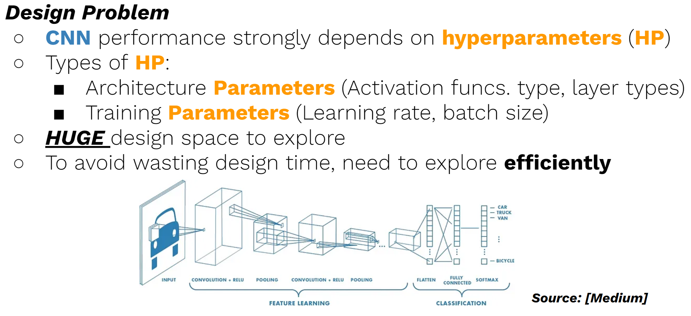
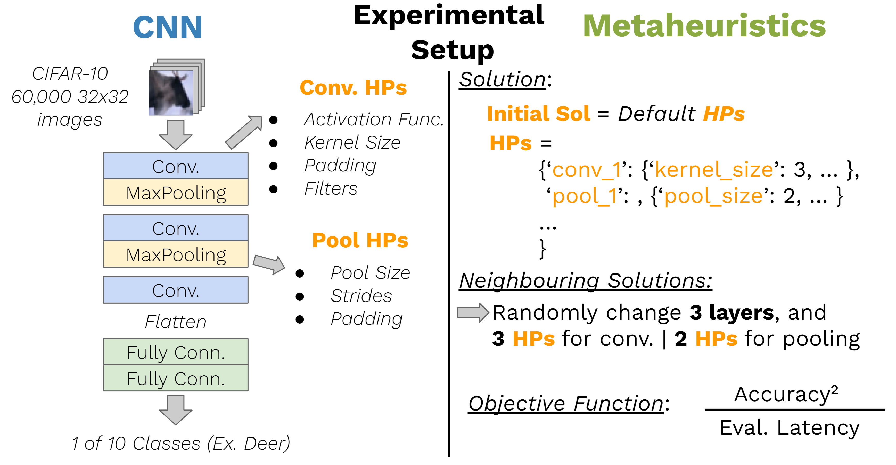
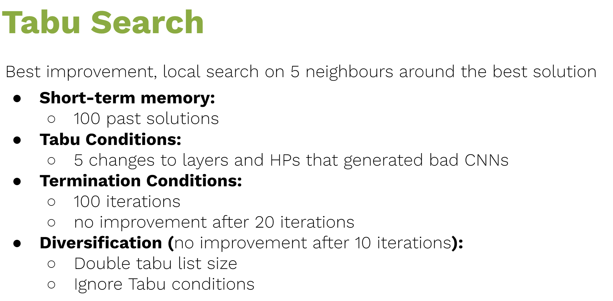
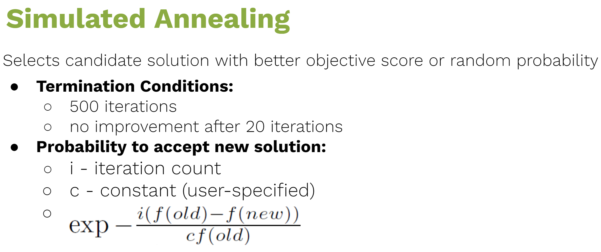
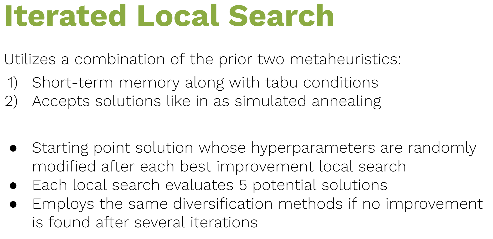
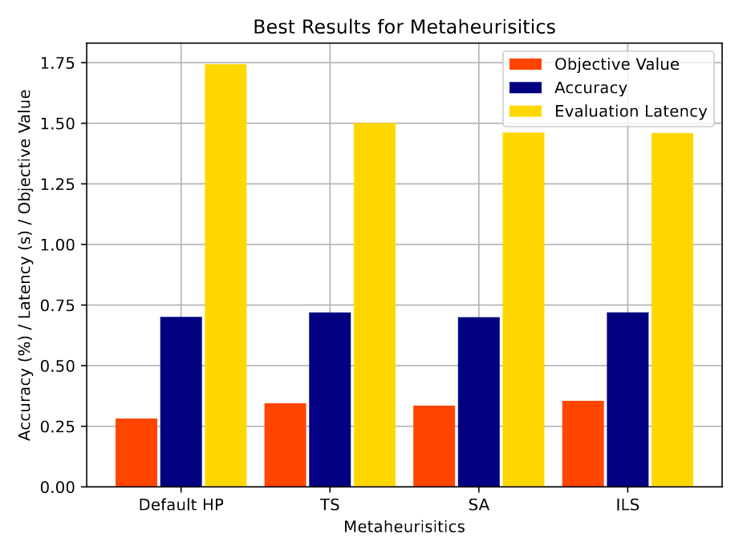
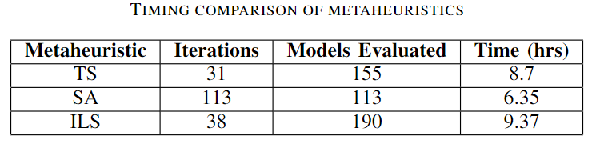

# **ECSE 541 Final Project: Hyperparameter Optimization using Trajectory-based Metaheuristics for Image Classification Convolutional Neural Networks**

## Overview of Repo
- [Report](ECSE_541_Final_Report.pdf): Final Project report highlighting the motivation and specific design choices for the CNN and metaheuristics, as well as their results.
- [Tabu Search](tabu.py): Custom implementation of Tabu Search
- [Simulated Annealing](simulated_annealing.py): Custom implementation of Simulated Annealing
- [Iterated Local Search](iterated_local_search.py): Custom implementation of Iterated Local Search
- [CNN Implementation](cnn.py): File containing the tensorFlow-based CNN that is trained on the CIFAR-10 dataset for 10 epochs, batch size of 16, Adam optimizer, and tf.keras.losses.SparseCategoricalCrossentropy loss.
- [Helper Functions](cnn_helper.py): Contains functions used by each metaheuristic to:

    1.) Train new CNN with a given set of hyperparameters

    2.) Retrieve new solutions from solution neighbourhood

    3.) Log runs

## High-level overview of Project


Inspired by our class discussion on “Metaheuristics in combinatorial optimization: Overview and conceptual comparison” by C. Blum and A. Roli, our project aims to optimize the architectural hyperparameters of an image classification convolutional neural network (CNN), by exploring the potential of trajectory-based metaheuristics algorithms. We evaluate how well different meta-heuristics can find candidate hyperparameters, comparing the performances of the resulting CNNs in both accuracy and evaluation latency. We would like to extend past work by investigating trajectory-based algorithms like *Tabu Search (TS)*, *Simulated Annealing (SA)*, and *Iterated Local Search (ILS)*.

In more detail, the project will entail the following tasks:
1) Build a parametrizable CNN for image recognition trained on the CIFAR10 dataset.
2) Build optimization algorithms for the CNN using different meta-heuristics.
3) Optimize the parameters of the CNN using the optimization algorithms and compare the test accuracies for the
resulting sets of parameters.

## Setup


For this project, the CNN has seven layers, consisting of two pairs of 2D convolutional layers with a 2D max pooling layer, another 2D convolutional layer, and two fully connected layers. The CNN input is images from the CIFAR10 dataset, broken into 32x32 pixels divided into separate RGB channels, and the output is the classification for one of 10 object categories (bird, cat, truck, etc.). For our purposes, the number of layers will stay constant, and we seek to optimize only the hyperparameters of the convolutional and pooling layers. The hyperparameters for both are: 
* 2D Convolutional Layer - Filters, Kernel Size, Activation Function, Padding 
* 2D Max Pooling Layer - Pool Size, Strides, Padding

To create the CNN, we will be using the TensorFlow library, and program the CNN and metaheuristics in Python. We perform our evaluations on Google Collab’s GPUs and locally on a NVIDIA GeForce RTX 2070. 

### Metaheurisitics 

To map the CNN hyperparameter optimization problem onto a metaheuristic algorithm, we had to uniquely define:

* The solution representation
* Neighbouring Solutions
* Fitness/objective function

Each solution is expressed as a nested dictionary whose keys are the five layers, and values are also dictionaries containing the relevant hyperparameters as keys and their assigned attributes. For a given best solution as a reference, to find neighbouring solutions we stochastically choose three layers and again stochastically choose one or two hyperparameters in each, depending on the layer type, to change. The new hyperparameter value is randomly sampled from a predetermined set of values for that specific hyperparameter. Lastly, we use the accuracy and latency of the trained CNN model on an evaluation dataset to define the following objective function: 

```
Objective Function = (Accuracy^2) / (Latency)
```


We chose this definition as we want to optimize the trade-off between evaluation latency and the accuracy of the optimized CNN. Accuracy is squared to ensure that changes in accuracy are dominant over changes in latency. As an initial solution, we use the default hyperparameters of the CNN as a universal starting point for all metaheuristics since we assume that the optimal hyperparameters will be nearby.


## Metaheuristics Overview











## Results

We evaluate candidate CNN solutions based on their accu-
racy and their test latency, reflected in the objective function
shown in equation 1. CNNs are compiled in TensorFlow using
the “adam” optimizer to minimize “SparseCategoricalCrossen-
tropy” loss. CNNs are then trained on 50,000 32x32 images
for 10 epochs from the CIFAR10 dataset, and tested on 10,000
unseen images. We run each metaheuristic 5 times and select
the best-performing model in terms of accuracy and latency
for our comparison. We do not include training time, since
at the end of the optimization, we have a trained model that
we can use directly. Even when having to retrain the CNN
after the optimization, either because the predictor was used
in the optimization or because a larger dataset for training is
available, the training time will be negligible compared to the
optimization time. 





As shown in the above figure, each metaheuristic can find a better hyperparameter solution that improves both test latency and accuracy over the default hyperparameters that initially achieve 68% accuracy and 1.74 s latency. ILS provides the best overall improvement, with the highest accuracy improvement of 4%, and latency drop by 16.3% over the default hyperparameters. For reference, TS provides 72% accuracy and 1.5 s latency, SA provides 70% accuracy and 1.4614 s latency, and ILS provides 72% accuracy and 1.4598 s latency. We also compared the wall clock time for running these searches through the above table which highlights the number of iterations, models evaluated, and wall clock time required for each metaheuristic. As expected, SA runs the shortest and ILS and TS run for much longer due to performing more evaluations. It is also worth noting that throughout these searches, improvements to latency were more common than accuracy. Even though SA evaluates fewer models, it can find a latency comparable to ILS and better than TS, while still improving test accuracy. Thus, this suggests a tradeoff between intensification-focused approaches like ILS and TS which is needed to find higher accuracy solutions, but not necessary for improving latency where SA is sufficient.
